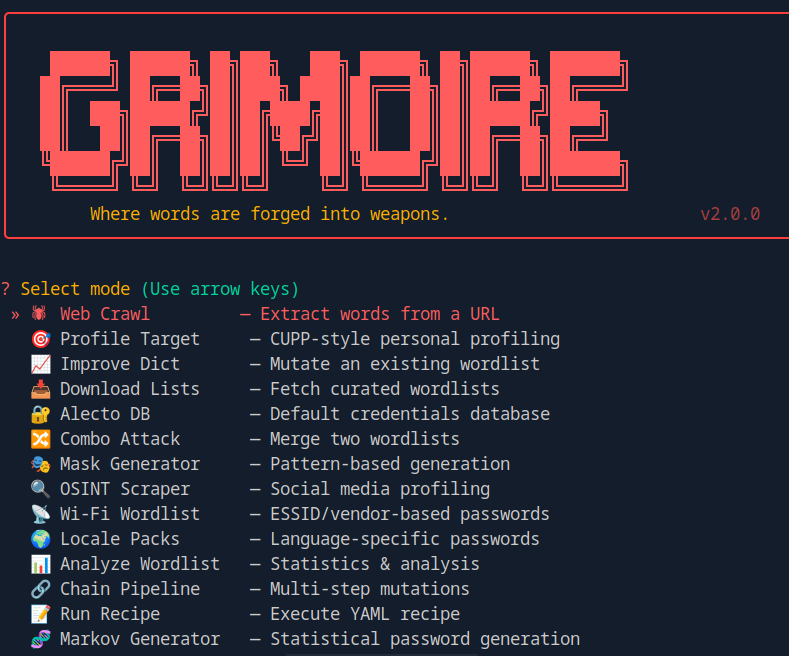

# GRIMOIRE 🔮

<p align="center">
  
</p>

> **An advanced wordlist/password generator** combining CeWL-style web crawling, CUPP-style target profiling, Hashcat-compatible mutations, OSINT scraping, Markov generation, and more — all in pure Python with a beautiful interactive TUI.

[](https://python.org)
[](LICENSE)
[](https://github.com/Azazelx0/grimoire)

---

## ✨ Features

| Feature | Description |
|---------|-------------|
| 🕷 **Web Crawling** | Static HTTP + optional headless JS rendering (Playwright). Configurable depth, delay, proxy |
| 🎯 **Target Profiling** | CUPP-style — name, DOB, partner, pet, company → personalized wordlists |
| 🧬 **Mutation Engine** | Leet speak, case variants, append numbers/symbols/years, reverse, duplicate |
| 📜 **Hashcat Rules** | Full `.rule` file parser: `:`, `l`, `u`, `c`, `C`, `r`, `d`, `$X`, `^X`, `sXY`, `TN` |
| 📧 **Email Harvesting** | RFC-compliant email extraction during crawl |
| 🔍 **OSINT Scraper** | Extract keywords from GitHub profiles and public pages |
| 🔀 **Combo Attack** | Merge two wordlists by concatenating every pair |
| 🎭 **Mask Generator** | Pattern-based generation (`?u?l?l?d?d` → `Ab3c12`) |
| 📡 **Wi-Fi Wordlist** | ESSID/vendor-based password generation with common patterns |
| 🌍 **Locale Packs** | Language-specific common passwords (EN, TR, DE, ES, FR, AR) |
| � **Wordlist Analysis** | Length histograms, charset breakdown, entropy, pattern detection |
| 🔗 **Chain Pipeline** | Multi-step mutations: `leet -> numbers(0-99) -> policy(min:8)` |
| 📝 **Recipe System** | YAML-based automation: crawl → profile → mutate → filter → export |
| 🧬 **Markov Generator** | Train on wordlists, generate statistically probable passwords |
| 🛡 **Policy Filter** | Filter output by password requirements (min/max length, upper, digit, special) |
| � **Alecto DB** | Bundled default device credentials (routers, IoT, network gear) |
| 📥 **Dict Downloader** | Fetch curated wordlists from SecLists by category |
| 📈 **Dict Improver** | Feed existing wordlists through the mutation engine |
| 🔄 **Deduplication** | Exact + fuzzy (Levenshtein-based) dedup |
| 📤 **Multi-Format** | Output: plaintext, JSON (with frequency), Hashcat rules |
| 🎨 **Rich TUI** | Beautiful colored interface powered by Rich — no raw ANSI escape codes |
| 🔁 **Interactive REPL** | Tab-complete shell — mutate, export, analyze, profile without restarting |

---

## 🚀 Quick Start

### Install

```bash
git clone https://github.com/Azazelx0/grimoire.git
cd grimoire
pip install -r requirements.txt
pip install -e .
```

### Run

```bash
grimoire              # Interactive wizard (14 modes)
grimoire --help       # Full flag reference
```

### Interactive Mode

Running `grimoire` without flags launches the interactive mode selector:

```
? Select mode
❯ 🕷  Web Crawl         — Extract words from a URL
  🎯 Profile Target     — CUPP-style personal profiling
  📈 Improve Dict       — Mutate an existing wordlist
  📥 Download Lists     — Fetch curated wordlists
  🔐 Alecto DB          — Default credentials database
  🔀 Combo Attack       — Merge two wordlists
  🎭 Mask Generator     — Pattern-based generation
  🔍 OSINT Scraper      — Social media profiling
  📡 Wi-Fi Wordlist     — ESSID/vendor-based passwords
  🌍 Locale Packs       — Language-specific passwords
  📊 Analyze Wordlist   — Statistics & analysis
  🔗 Chain Pipeline     — Multi-step mutations
  📝 Run Recipe         — Execute YAML recipe
  🧬 Markov Generator   — Statistical password generation
```

---

## 📖 Usage Examples

### Web Crawl

```bash
# Basic crawl
grimoire --url https://example.com --depth 2 -o wordlist.txt

# With mutations + emails
grimoire --url https://target.com --depth 3 --emails --mutate --leet -o mutated.txt

# JS-heavy site (requires: pip install playwright && playwright install chromium)
grimoire --url https://spa-app.com --mode headless -o js-words.txt

# Authenticated + stealth
grimoire --url https://intranet.corp.com \
  --cookie "PHPSESSID=abc123" \
  --proxy socks5://127.0.0.1:9050 \
  --random-ua --delay 1000 -o stealth.txt
```

### Target Profiling (CUPP-style)

```bash
# Interactive
grimoire  # → select "Profile Target"

# Scripted
grimoire --profile "name=John last=Smith dob=1990 pet=Rex company=Acme" -o john.txt
```

### Mask Generator

```bash
# Generate all ?u?l?l?d?d combinations (Aaa00-Zzz99)
grimoire --mask "?u?l?l?d?d" -o mask.txt

# Charsets: ?l=lower ?u=upper ?d=digit ?s=special ?a=all
```

### Combo Attack

```bash
grimoire --combo wordlist1.txt wordlist2.txt -o combined.txt
```

### OSINT Scraper

```bash
grimoire --osint username -o keywords.txt
```

### Wi-Fi Wordlist

```bash
grimoire --wifi-essid "NETGEAR42" --wifi-vendor netgear -o wifi.txt
```

### Chain Pipeline

```bash
grimoire --chain "leet -> case -> numbers(0-99) -> policy(min:8)" \
  --file input.txt -o chained.txt
```

### Recipe System

```yaml
# recipe.yml
name: corporate-pentest
steps:
  - crawl: {url: "https://corp.com", depth: 3}
  - profile: {name: John, company: Acme}
  - mutate: [leet, case, numbers]
  - policy: {min: 8, upper: 1, digit: 1}
  - export: corporate-wordlist.txt
```

```bash
grimoire --recipe recipe.yml
```

### Markov Generator

```bash
grimoire --markov-train wordlist.txt --markov-count 50000 -o markov.txt
```

### Alecto Default Credentials

```bash
grimoire --alecto "cisco"     # Search by vendor
grimoire --alecto ""          # Dump all
```

### Wordlist Analysis

```bash
grimoire --stats wordlist.txt
```

### Locale Packs

```bash
grimoire --locale en,tr,de -o locale-words.txt
```

### Policy Filter

```bash
grimoire --mask "?l?l?l?l?d?d" --policy "min:6 upper:0 digit:1" -o filtered.txt
```

---

## 🖥 REPL Commands

After any operation, GRIMOIRE drops into an interactive REPL with tab-completion:

```
grimoire❯ help
```

| Command | Description |
|---------|-------------|
| `help` | Show all commands |
| `stats` / `analyze` | Wordlist statistics + histogram |
| `export <file>` | Export wordlist |
| `mutate [--leet] [--case] [--numbers]` | Apply mutations |
| `profile` | Launch target profiling |
| `alecto [search <vendor>]` | Browse default credentials |
| `download <category>` | Download wordlist category |
| `improve <file>` | Improve existing wordlist |
| `dedup [--fuzzy]` | Deduplicate |
| `policy min:8 upper:1 ...` | Filter by password policy |
| `load <file>` | Load wordlist from file |
| `save <file>` | Save wordlist |
| `set <key> <value>` | Change session setting |
| `clear` | Reset wordlist |
| `exit` | Quit |

---

## 📊 Comparison

| Feature | CeWL | CUPP | **GRIMOIRE** |
|---------|------|------|--------------|
| Web crawling | ✅ | ❌ | ✅ (static + headless) |
| Target profiling | ❌ | ✅ | ✅ (enhanced) |
| Mutation engine | ❌ | Basic | ✅ (full + Hashcat rules) |
| Combo attack | ❌ | ❌ | ✅ |
| Mask generator | ❌ | ❌ | ✅ |
| OSINT scraping | ❌ | ❌ | ✅ |
| Wi-Fi wordlists | ❌ | ❌ | ✅ |
| Locale packs | ❌ | ❌ | ✅ (6 languages) |
| Wordlist analysis | ❌ | ❌ | ✅ (entropy, histograms) |
| Chain mutations | ❌ | ❌ | ✅ |
| Recipe system | ❌ | ❌ | ✅ (YAML automation) |
| Markov generator | ❌ | ❌ | ✅ |
| Policy filter | ❌ | ❌ | ✅ |
| Email harvesting | ✅ | ❌ | ✅ |
| Default creds DB | ❌ | ✅ | ✅ (bundled Alecto) |
| Interactive REPL | ❌ | ❌ | ✅ (tab-complete) |
| Multi-format output | text | text | ✅ (txt/JSON/Hashcat) |
| Cross-platform | Ruby | Python | ✅ (Python, any OS) |
| No compilation | ❌ | ✅ | ✅ |

---

## 📁 Project Structure

```
grimoire/
├── pyproject.toml              # Package config → `grimoire` command
├── requirements.txt            # Core dependencies
├── grimoire/
│   ├── cli.py                  # Click CLI with 40+ flags
│   ├── banner.py               # Rich Panel ASCII banner
│   ├── wizard.py               # 14-mode interactive selector
│   ├── repl.py                 # Tab-complete REPL shell
│   ├── crawler/                # Static + headless crawlers
│   ├── extractor.py            # Word/email/meta/JS extraction
│   ├── mutator/                # Basic + Hashcat rules + combo
│   ├── profiler.py             # CUPP-style target profiling
│   ├── alecto.py               # Default credentials DB
│   ├── mask.py                 # Mask/pattern generator
│   ├── osint.py                # OSINT social scraper
│   ├── wifi.py                 # Wi-Fi ESSID generator
│   ├── locale_packs.py         # Language packs
│   ├── stats.py                # Wordlist analysis
│   ├── chain.py                # Pipeline mutations
│   ├── recipe.py               # YAML recipe system
│   ├── policy.py               # Password policy filter
│   ├── markov.py               # Markov chain generator
│   ├── dedup.py                # Exact + fuzzy dedup
│   ├── output.py               # txt/json/hashcat writers
│   └── data/                   # Alecto CSV + locale packs
├── docs/                       # Reference documentation
└── examples/                   # Usage scripts + rule files
```

---

## 📄 License

MIT License. See [LICENSE](LICENSE) for details.

## 🤝 Contributing

See [CONTRIBUTING.md](CONTRIBUTING.md) for guidelines.

## 📚 Documentation

- [Flag Reference](docs/flags.md)
- [REPL Commands](docs/repl-commands.md)
- [Hashcat Rule Syntax](docs/rule-syntax.md)

---

> **GRIMOIRE** — *Where words are forged into weapons.* 🔮
